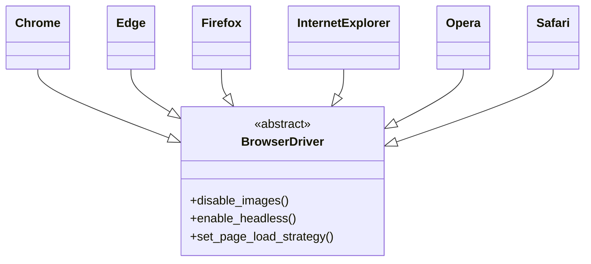

# About Browser Driver
The browser factory is based on the `BrowserDriver` abstract class that initializes relevant settings for various browsers versions, several abstract methods, and the Selenium web driver. Each sub class to the `BrowserDriver` then implements the specific methods relevant for Chrome, Edge, Firefox, etc.

